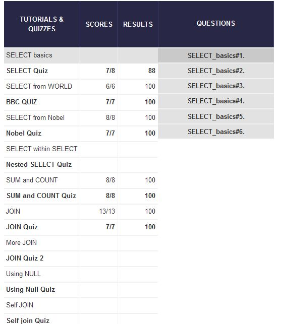

## U3.W7: SQLZoo

####I worked on this challenge by myself.

### My Quiz Results:

### Reflection
I enjoyed this first step in learning SQL because it feels like a really useful language to learn. I didn't
really like the difficulty curve of the SQLZoo exercises however, and as the directions said, I had to do 
a lot of outside research to learn more. Some things that I'm not 100% sure on right now are how GROUP BY
(especially when it takes multiple parameters) and certain uses of the * symbol.
