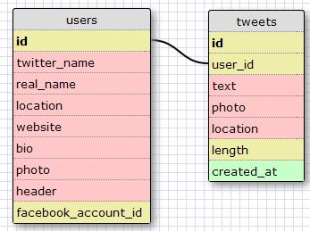

# U3.W7: Modeling a Real-World Database (SOLO CHALLENGE)

## Release 0: Users Fields
<!-- Identify the fields Twitter collects data for -->
twitter_name
real_name
location
website
bio
photo
header
facebook_account_id

## Release 1: Tweet Fields
<!-- Identify the fields Twitter uses to represent/display a tweet. What are you required or allowed to enter? -->
user_id
text
photo
location
length
created_at

## Release 2: Explain the relationship
The relationship between `users` and `tweets` is: 
<!-- because... -->
`users` and `tweets` form a one to many relationship. One user can have many tweets but any one tweet can only come from one user.

## Release 3: Schema Design

## Release 4: SQL Statements
<!-- Include your SQL Statements. How can you make markdown files show blocks of code? -->

all the tweets for a certain user id

``SELECT text FROM tweets WHERE user_id = 'DBC'``

the tweets for a certain user id that were made after last Wednesday (whenever last Wednesday was for you)

``SELECT text FROM tweets WHERE user_id = 'DBC' AND created_at > '2014-04-16'``

all the tweets associated with a given user's twitter handle

``SELECT text FROM users JOIN tweets ON users.id = user_id WHERE twitter_name = 'DBC'``

the twitter handle associated with a given tweet id

``SELECT twitter_name FROM users JOIN tweets ON users.id = user_id WHERE tweet_id = 'id'``

## Release 5: Reflection
<!-- Be sure to add your reflection here!!! -->
I'm unsure about some of the fields I added like facebook_account_id for users and length for tweets. I added the Facebook one because Twitter does allow you to link your Facebook account. For tweets, I don't know if Twitter actually keeps track of the length but I put that in there anyway. It's interesting to see how SQL and these databases work together in a real-world application so I want to learn more!
