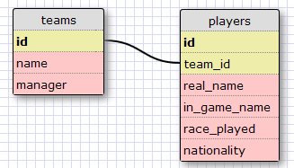

I modeled a Starcraft team for this challenge in a one to many relationship. Here was my schema:

This is the team that I used to input information into my database: http://www.teamliquid.net/tlpd/hots/teams/24_Evil_Geniuses

This was good review. There was a lot about SQL that I forgot already even though it's only been 2 weeks. This was the site that I used to learn how to join tables in SQLite: http://www.sqlite.org/foreignkeys.html

Overall I'm beginning to become more confident in using SQlite, although I wish I knew an easier way to input data into the command line!
